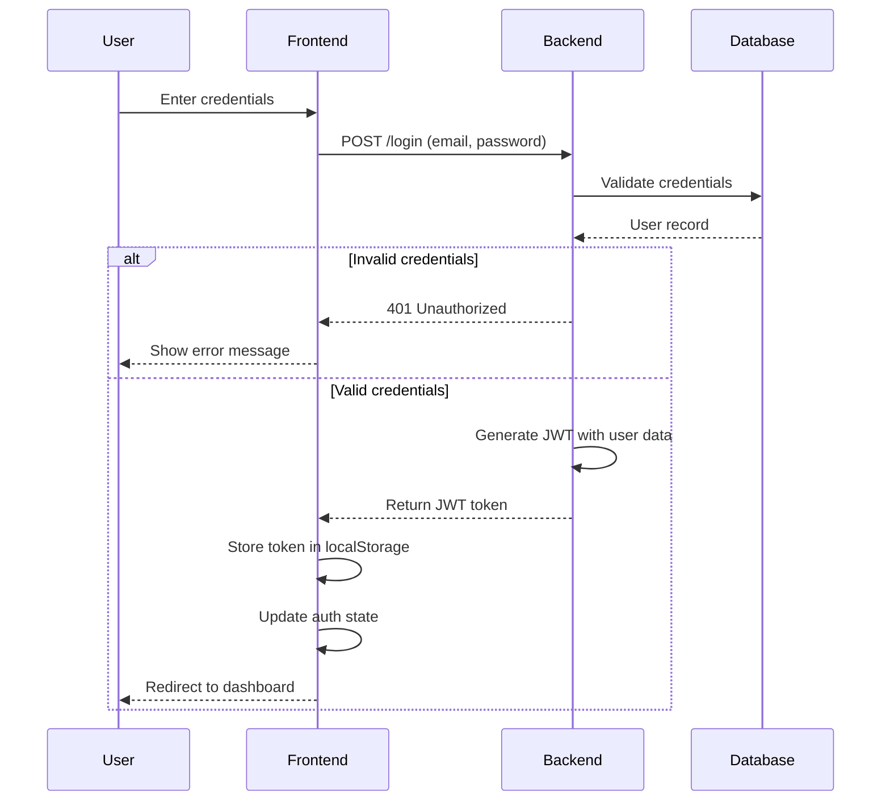
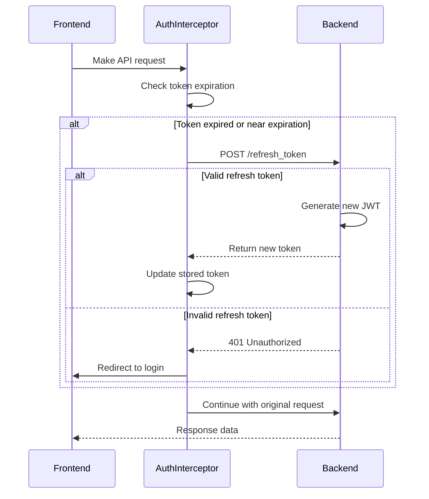
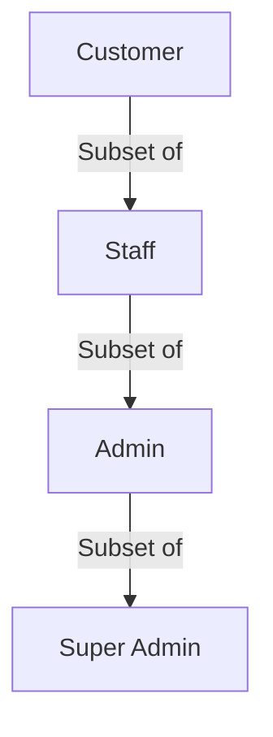
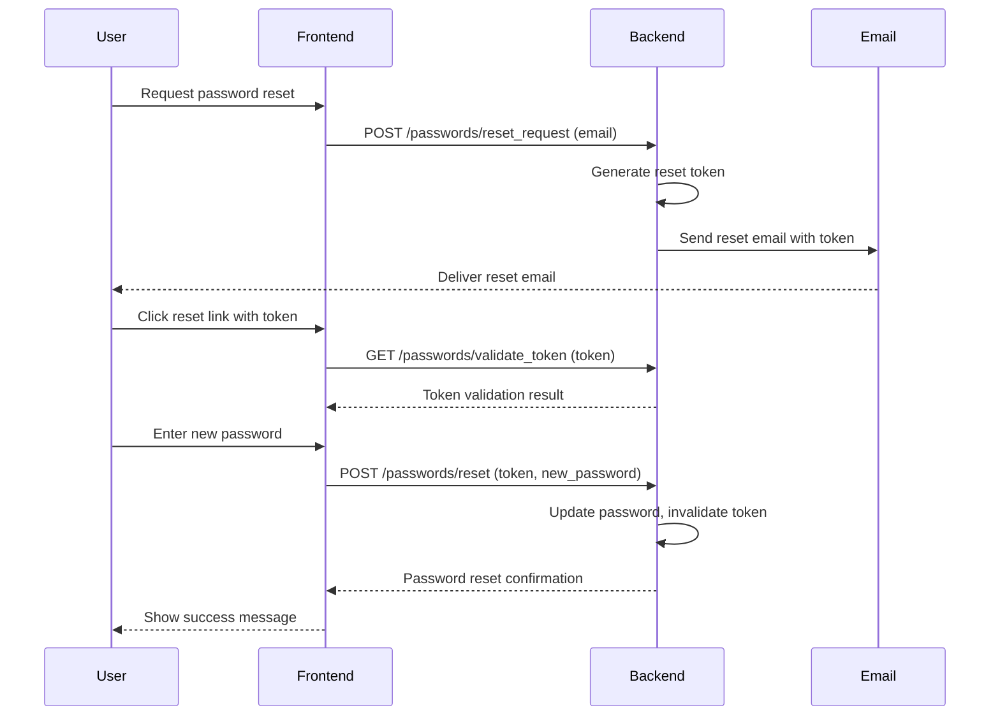

# Authentication and Authorization

This document provides a comprehensive overview of the authentication and authorization system in Hafaloha, covering both frontend and backend implementations.

## Overview

Hafaloha implements a secure, token-based authentication system with role-based access control. The system provides:

- **JWT-based Authentication**: Secure, stateless authentication using JSON Web Tokens
- **Role-based Authorization**: Different access levels for customers, staff, admins, and super admins
- **Multi-tenant Security**: Data isolation between different restaurant tenants
- **Password Security**: Secure password storage with bcrypt hashing
- **Token Refresh**: Automatic token refresh for persistent sessions
- **Social Authentication**: Optional integration with social login providers

## Authentication Flow

### Login Process

1. **User Credentials**: User submits email/password via login form
2. **Server Validation**: Backend validates credentials against stored hash
3. **JWT Generation**: On successful validation, server generates a JWT containing user ID, role, and restaurant context
4. **Token Response**: JWT is returned to the client
5. **Token Storage**: Frontend stores the token in localStorage and Zustand auth store
6. **Authenticated State**: Frontend updates UI to reflect authenticated state



### Registration Process

1. **User Information**: User submits registration details
2. **Validation**: Backend validates email uniqueness and password strength
3. **User Creation**: New user record is created with hashed password
4. **Restaurant Association**: User is associated with a restaurant (tenant)
5. **JWT Generation**: Authentication token is generated
6. **Welcome Email**: Optional welcome email is sent to the user

### Token Refresh

1. **Token Expiration Check**: Frontend checks token expiration before requests
2. **Refresh Request**: If token is near expiration, a refresh request is sent
3. **Token Validation**: Backend validates the existing token
4. **New Token**: If valid, a new token with extended expiration is issued
5. **Token Update**: Frontend updates stored token



## Authorization System

### Role-Based Access Control

Hafaloha implements role-based access control with the following roles:

1. **Customer**: Regular users who can place orders and make reservations
2. **Staff**: Restaurant employees who can view and manage orders
3. **Admin**: Restaurant administrators with full access to restaurant settings
4. **Super Admin**: Platform administrators who can manage multiple restaurants

Each role has progressively more permissions:



### Permission Matrix

| Feature | Customer | Staff | Admin | Super Admin |
|---------|----------|-------|-------|------------|
| View Menu | ✓ | ✓ | ✓ | ✓ |
| Place Order | ✓ | ✓ | ✓ | ✓ |
| Make Reservation | ✓ | ✓ | ✓ | ✓ |
| View Own Orders | ✓ | ✓ | ✓ | ✓ |
| View All Orders | ✗ | ✓ | ✓ | ✓ |
| Manage Orders | ✗ | ✓ | ✓ | ✓ |
| View Inventory | ✗ | ✓ | ✓ | ✓ |
| Manage Inventory | ✗ | ✗ | ✓ | ✓ |
| Manage Menu | ✗ | ✗ | ✓ | ✓ |
| Manage Staff | ✗ | ✗ | ✓ | ✓ |
| Manage Restaurant Settings | ✗ | ✗ | ✓ | ✓ |
| Access Multiple Restaurants | ✗ | ✗ | ✗ | ✓ |
| Manage Platform Settings | ✗ | ✗ | ✗ | ✓ |

### Multi-tenant Authorization

The authorization system enforces data isolation between restaurant tenants:

1. **Restaurant Context**: Each request includes the restaurant context
2. **Default Scoping**: Database queries are automatically scoped to the current restaurant
3. **Cross-tenant Prevention**: Users cannot access data from other restaurants
4. **Super Admin Exception**: Super admins can access data across restaurants

## Backend Implementation

### User Model

```ruby
# app/models/user.rb
class User < ApplicationRecord
  apply_default_scope
  belongs_to :restaurant
  
  has_secure_password
  
  validates :email, presence: true, uniqueness: { scope: :restaurant_id }
  validates :password, length: { minimum: 8 }, if: -> { password.present? }
  
  enum role: {
    customer: 'customer',
    staff: 'staff',
    admin: 'admin',
    super_admin: 'super_admin'
  }
  
  # Check if user has a specific role or higher
  def has_role?(required_role)
    case required_role.to_s
    when 'customer'
      true # All users have at least customer role
    when 'staff'
      staff? || admin? || super_admin?
    when 'admin'
      admin? || super_admin?
    when 'super_admin'
      super_admin?
    else
      false
    end
  end
end
```

### Authentication Controller

```ruby
# app/controllers/sessions_controller.rb
class SessionsController < ApplicationController
  skip_before_action :authenticate_user, only: [:create, :refresh]
  
  # Override to allow public access to login and token refresh
  def public_endpoint?
    action_name.in?(['create', 'refresh'])
  end
  
  # POST /login
  def create
    @user = User.find_by(email: params[:email])
    
    if @user&.authenticate(params[:password])
      token = generate_token(@user)
      
      render json: {
        token: token,
        user: UserSerializer.new(@user).as_json
      }
    else
      render json: { error: "Invalid email or password" }, status: :unauthorized
    end
  end
  
  # POST /refresh_token
  def refresh
    begin
      decoded_token = JWT.decode(
        params[:token], 
        Rails.application.credentials.secret_key_base,
        true, 
        { algorithm: 'HS256' }
      )[0]
      
      user_id = decoded_token['user_id']
      @user = User.find(user_id)
      
      token = generate_token(@user)
      
      render json: { token: token }
    rescue JWT::ExpiredSignature, JWT::DecodeError, ActiveRecord::RecordNotFound
      render json: { error: "Invalid or expired token" }, status: :unauthorized
    end
  end
  
  # DELETE /logout
  def destroy
    # JWT is stateless, so we don't need to do anything server-side
    # The client will remove the token
    render json: { message: "Logged out successfully" }
  end
  
  private
  
  def generate_token(user)
    payload = {
      user_id: user.id,
      restaurant_id: user.restaurant_id,
      role: user.role,
      exp: 24.hours.from_now.to_i
    }
    
    JWT.encode(payload, Rails.application.credentials.secret_key_base)
  end
end
```

### Authorization Middleware

```ruby
# app/controllers/application_controller.rb
class ApplicationController < ActionController::API
  include RestaurantScope
  
  before_action :authenticate_user
  
  private
  
  def authenticate_user
    header = request.headers['Authorization']
    token = header.split(' ').last if header
    
    begin
      @decoded_token = JWT.decode(
        token, 
        Rails.application.credentials.secret_key_base,
        true, 
        { algorithm: 'HS256' }
      )[0]
      
      @current_user = User.find(@decoded_token['user_id'])
    rescue JWT::ExpiredSignature, JWT::DecodeError, ActiveRecord::RecordNotFound
      render json: { error: "Unauthorized" }, status: :unauthorized
    end
  end
  
  def current_user
    @current_user
  end
  
  def authorize_role(required_role)
    unless current_user&.has_role?(required_role)
      render json: { error: "Unauthorized" }, status: :forbidden
    end
  end
  
  def authorize_staff
    authorize_role(:staff)
  end
  
  def authorize_admin
    authorize_role(:admin)
  end
  
  def authorize_super_admin
    authorize_role(:super_admin)
  end
end
```

### Role-based Controller Example

```ruby
# app/controllers/admin/users_controller.rb
class Admin::UsersController < ApplicationController
  before_action :authorize_admin
  
  # GET /admin/users
  def index
    @users = User.where(restaurant_id: current_user.restaurant_id)
    render json: @users
  end
  
  # POST /admin/users
  def create
    # Only admins can create staff and admin users
    if params[:role] == 'super_admin' && !current_user.super_admin?
      return render json: { error: "Unauthorized to create super admin users" }, status: :forbidden
    end
    
    @user = User.new(user_params)
    @user.restaurant_id = current_user.restaurant_id
    
    if @user.save
      render json: @user, status: :created
    else
      render json: { errors: @user.errors }, status: :unprocessable_entity
    end
  end
  
  # Additional actions...
  
  private
  
  def user_params
    params.require(:user).permit(:name, :email, :password, :role, :phone)
  end
end
```

## Frontend Implementation

### Auth Store

```tsx
// src/shared/auth/authStore.ts
import create from 'zustand';
import { persist } from 'zustand/middleware';
import { login, refreshToken, logout } from '../api/endpoints/auth';
import { User } from '../types/user';

interface AuthState {
  user: User | null;
  token: string | null;
  isAuthenticated: boolean;
  isLoading: boolean;
  error: string | null;
  
  login: (email: string, password: string) => Promise<void>;
  logout: () => Promise<void>;
  refreshToken: () => Promise<void>;
  setUser: (user: User) => void;
  hasRole: (role: string) => boolean;
}

export const useAuthStore = create<AuthState>(
  persist(
    (set, get) => ({
      user: null,
      token: null,
      isAuthenticated: false,
      isLoading: false,
      error: null,
      
      login: async (email, password) => {
        set({ isLoading: true, error: null });
        try {
          const response = await login(email, password);
          set({
            user: response.user,
            token: response.token,
            isAuthenticated: true,
            isLoading: false
          });
        } catch (error) {
          set({
            error: error.message,
            isLoading: false,
            isAuthenticated: false
          });
        }
      },
      
      logout: async () => {
        set({ isLoading: true });
        try {
          await logout();
          set({
            user: null,
            token: null,
            isAuthenticated: false,
            isLoading: false
          });
        } catch (error) {
          set({
            error: error.message,
            isLoading: false
          });
        }
      },
      
      refreshToken: async () => {
        if (!get().token) return;
        
        set({ isLoading: true });
        try {
          const response = await refreshToken(get().token);
          set({
            token: response.token,
            isLoading: false
          });
        } catch (error) {
          // If token refresh fails, log the user out
          get().logout();
        }
      },
      
      setUser: (user) => {
        set({ user });
      },
      
      hasRole: (requiredRole) => {
        const { user } = get();
        if (!user) return false;
        
        switch (requiredRole) {
          case 'customer':
            return true; // All users have at least customer role
          case 'staff':
            return ['staff', 'admin', 'super_admin'].includes(user.role);
          case 'admin':
            return ['admin', 'super_admin'].includes(user.role);
          case 'super_admin':
            return user.role === 'super_admin';
          default:
            return false;
        }
      }
    }),
    {
      name: 'auth-storage',
      getStorage: () => localStorage,
      partialize: (state) => ({ user: state.user, token: state.token }),
    }
  )
);
```

### API Client with Auth Interceptor

```tsx
// src/shared/api/apiClient.ts
import axios from 'axios';
import { useAuthStore } from '../auth/authStore';

const apiClient = axios.create({
  baseURL: import.meta.env.VITE_API_URL,
  headers: {
    'Content-Type': 'application/json'
  }
});

// Request interceptor for adding auth token
apiClient.interceptors.request.use(
  (config) => {
    const token = useAuthStore.getState().token;
    
    if (token) {
      config.headers.Authorization = `Bearer ${token}`;
    }
    
    return config;
  },
  (error) => Promise.reject(error)
);

// Response interceptor for token refresh
apiClient.interceptors.response.use(
  (response) => response,
  async (error) => {
    const originalRequest = error.config;
    
    // If error is 401 and we haven't already tried to refresh
    if (error.response?.status === 401 && !originalRequest._retry) {
      originalRequest._retry = true;
      
      try {
        // Try to refresh the token
        await useAuthStore.getState().refreshToken();
        
        // If successful, update the token in the request
        const token = useAuthStore.getState().token;
        originalRequest.headers.Authorization = `Bearer ${token}`;
        
        // Retry the original request
        return apiClient(originalRequest);
      } catch (refreshError) {
        // If refresh fails, redirect to login
        window.location.href = '/login';
        return Promise.reject(refreshError);
      }
    }
    
    return Promise.reject(error);
  }
);

export default apiClient;
```

### Protected Route Component

```tsx
// src/shared/auth/ProtectedRoute.tsx
import React from 'react';
import { Navigate, useLocation } from 'react-router-dom';
import { useAuthStore } from './authStore';
import LoadingSpinner from '../components/ui/LoadingSpinner';

interface ProtectedRouteProps {
  children: React.ReactNode;
  requiredRole?: 'customer' | 'staff' | 'admin' | 'super_admin';
}

const ProtectedRoute: React.FC<ProtectedRouteProps> = ({ 
  children, 
  requiredRole = 'customer' 
}) => {
  const { isAuthenticated, hasRole, isLoading } = useAuthStore();
  const location = useLocation();
  
  if (isLoading) {
    return <LoadingSpinner />;
  }
  
  if (!isAuthenticated) {
    // Redirect to login page, but save the location they were trying to access
    return <Navigate to="/login" state={{ from: location }} replace />;
  }
  
  if (!hasRole(requiredRole)) {
    // User is authenticated but doesn't have the required role
    return <Navigate to="/unauthorized" replace />;
  }
  
  // User is authenticated and has the required role
  return <>{children}</>;
};

export default ProtectedRoute;
```

### Login Form Component

```tsx
// src/shared/components/auth/LoginForm.tsx
import React, { useState } from 'react';
import { useNavigate, useLocation } from 'react-router-dom';
import { useAuthStore } from '../../auth/authStore';
import { useTranslation } from 'react-i18next';

const LoginForm: React.FC = () => {
  const { t } = useTranslation('auth');
  const navigate = useNavigate();
  const location = useLocation();
  const { login, isLoading, error } = useAuthStore();
  
  const [email, setEmail] = useState('');
  const [password, setPassword] = useState('');
  
  // Get the page they were trying to access before being redirected to login
  const from = (location.state as any)?.from?.pathname || '/dashboard';
  
  const handleSubmit = async (e: React.FormEvent) => {
    e.preventDefault();
    
    try {
      await login(email, password);
      
      // Redirect to the page they were trying to access
      navigate(from, { replace: true });
    } catch (error) {
      // Error is handled by the auth store
      console.error('Login failed:', error);
    }
  };
  
  return (
    <div className="login-form-container">
      <h2>{t('login.title')}</h2>
      
      {error && (
        <div className="error-message">
          {error}
        </div>
      )}
      
      <form onSubmit={handleSubmit}>
        <div className="form-group">
          <label htmlFor="email">{t('login.email')}</label>
          <input
            id="email"
            type="email"
            value={email}
            onChange={(e) => setEmail(e.target.value)}
            required
          />
        </div>
        
        <div className="form-group">
          <label htmlFor="password">{t('login.password')}</label>
          <input
            id="password"
            type="password"
            value={password}
            onChange={(e) => setPassword(e.target.value)}
            required
          />
        </div>
        
        <div className="form-actions">
          <button 
            type="submit" 
            className="login-button"
            disabled={isLoading}
          >
            {isLoading ? t('login.loggingIn') : t('login.submit')}
          </button>
        </div>
        
        <div className="form-links">
          <a href="/forgot-password">{t('login.forgotPassword')}</a>
          <a href="/signup">{t('login.createAccount')}</a>
        </div>
      </form>
    </div>
  );
};

export default LoginForm;
```

### Role-based UI Components

```tsx
// src/shared/components/ui/RoleBasedComponent.tsx
import React from 'react';
import { useAuthStore } from '../../auth/authStore';

interface RoleBasedComponentProps {
  requiredRole: 'customer' | 'staff' | 'admin' | 'super_admin';
  children: React.ReactNode;
  fallback?: React.ReactNode;
}

const RoleBasedComponent: React.FC<RoleBasedComponentProps> = ({
  requiredRole,
  children,
  fallback = null
}) => {
  const { hasRole } = useAuthStore();
  
  if (hasRole(requiredRole)) {
    return <>{children}</>;
  }
  
  return <>{fallback}</>;
};

export default RoleBasedComponent;
```

### Usage in Routes

```tsx
// src/RootApp.tsx
import React from 'react';
import { BrowserRouter, Routes, Route } from 'react-router-dom';
import { useAuthStore } from './shared/auth/authStore';
import ProtectedRoute from './shared/auth/ProtectedRoute';
import LoginPage from './shared/components/auth/LoginPage';
import SignupPage from './shared/components/auth/SignupPage';
import ForgotPasswordPage from './shared/components/auth/ForgotPasswordPage';
import UnauthorizedPage from './shared/components/auth/UnauthorizedPage';
import CustomerDashboard from './ordering/components/customer/CustomerDashboard';
import StaffDashboard from './ordering/components/staff/StaffDashboard';
import AdminDashboard from './ordering/components/admin/AdminDashboard';
import SuperAdminDashboard from './ordering/components/superadmin/SuperAdminDashboard';

const RootApp: React.FC = () => {
  const { isAuthenticated, hasRole } = useAuthStore();
  
  // Determine the appropriate dashboard based on user role
  const getDashboardRoute = () => {
    if (!isAuthenticated) return '/login';
    
    if (hasRole('super_admin')) return '/super-admin';
    if (hasRole('admin')) return '/admin';
    if (hasRole('staff')) return '/staff';
    return '/dashboard';
  };
  
  return (
    <BrowserRouter>
      <Routes>
        {/* Public routes */}
        <Route path="/login" element={<LoginPage />} />
        <Route path="/signup" element={<SignupPage />} />
        <Route path="/forgot-password" element={<ForgotPasswordPage />} />
        <Route path="/unauthorized" element={<UnauthorizedPage />} />
        
        {/* Protected routes with role-based access */}
        <Route 
          path="/dashboard" 
          element={
            <ProtectedRoute>
              <CustomerDashboard />
            </ProtectedRoute>
          } 
        />
        
        <Route 
          path="/staff" 
          element={
            <ProtectedRoute requiredRole="staff">
              <StaffDashboard />
            </ProtectedRoute>
          } 
        />
        
        <Route 
          path="/admin" 
          element={
            <ProtectedRoute requiredRole="admin">
              <AdminDashboard />
            </ProtectedRoute>
          } 
        />
        
        <Route 
          path="/super-admin" 
          element={
            <ProtectedRoute requiredRole="super_admin">
              <SuperAdminDashboard />
            </ProtectedRoute>
          } 
        />
        
        {/* Redirect to appropriate dashboard based on role */}
        <Route path="/" element={<Navigate to={getDashboardRoute()} />} />
      </Routes>
    </BrowserRouter>
  );
};

export default RootApp;
```

## Password Management

### Password Reset Flow

1. **Reset Request**: User requests password reset via email
2. **Token Generation**: Secure reset token is generated and stored
3. **Email Delivery**: Reset link with token is sent to user's email
4. **Token Validation**: User clicks link, token is validated
5. **Password Update**: User sets new password
6. **Token Invalidation**: Reset token is invalidated after use



### Password Policy

The system enforces the following password requirements:

1. **Minimum Length**: 8 characters
2. **Complexity**: Must include at least one uppercase letter, one lowercase letter, and one number
3. **Common Password Check**: Prevents use of commonly used passwords
4. **Password History**: Prevents reuse of recent passwords
5. **Expiration Policy**: Optional password expiration for high-security environments

## Social Authentication

Hafaloha supports optional integration with social authentication providers:

1. **Google Authentication**: Login with Google account
2. **Facebook Authentication**: Login with Facebook account
3. **Apple Authentication**: Login with Apple ID

The social authentication flow:

1. **Provider Selection**: User selects social login provider
2. **OAuth Redirect**: User is redirected to provider's authentication page
3. **Authorization**: User authorizes the application
4. **Token Exchange**: Provider returns authorization code
5. **User Lookup/Creation**: Backend finds or creates user based on provider data
6. **JWT Generation**: Authentication token is generated
7. **Account Linking**: Optional linking with existing account

## Security Considerations

### Token Security

1. **Short Expiration**: JWTs have a relatively short expiration time (24 hours)
2. **Secure Storage**: Tokens are stored in localStorage with appropriate precautions
3. **HTTPS Only**: All API communication is over HTTPS
4. **Token Refresh**: Automatic token refresh to maintain session
5. **Logout Handling**: Proper token cleanup on logout

### CSRF Protection

1. **Token-based Auth**: JWT-based authentication provides inherent CSRF protection
2. **SameSite Cookies**: When cookies are used, they are set with SameSite=Strict
3. **Origin Validation**: API requests validate Origin/Referer headers

### XSS Protection

1. **Content Security Policy**: Strict CSP headers to prevent script injection
2. **Input Sanitization**: All user inputs are sanitized before rendering
3. **HttpOnly Cookies**: Sensitive cookies are marked HttpOnly when used
4. **Output Encoding**: All dynamic content is properly encoded

## Best Practices

When working with the authentication and authorization system, follow these best practices:

1. **Always Use Protected Routes**: Wrap components requiring authentication in ProtectedRoute
2. **Check Roles Explicitly**: Use hasRole() to check for specific role requirements
3. **Handle Auth Errors**: Properly handle and display authentication errors
4. **Refresh Tokens Proactively**: Refresh tokens before they expire to prevent session interruption
5. **Secure Sensitive Routes**: Apply appropriate role requirements to sensitive routes
6. **Clear Auth Data on Logout**: Ensure all auth data is cleared when logging out
7. **Validate on Both Ends**: Always validate permissions on both frontend and backend

## Troubleshooting

Common issues and their solutions:

1. **Unauthorized Errors**: Check token expiration and role permissions
2. **Missing Auth Headers**: Ensure API client is correctly adding Authorization header
3. **Token Refresh Loops**: Check for proper handling of refresh token failures
4. **Cross-tenant Access Issues**: Verify restaurant context is correctly set
5. **Role Permission Problems**: Confirm user has the required role for the action

## Future Enhancements

Planned enhancements for the authentication and authorization system:

1. **Two-Factor Authentication**: Add optional 2FA for enhanced security
2. **OAuth 2.0 Support**: Expanded OAuth provider support
3. **Permission-based Authorization**: More granular permissions beyond roles
4. **Audit Logging**: Comprehensive logging of authentication and authorization events
5. **Session Management**: Admin tools for viewing and managing active sessions
